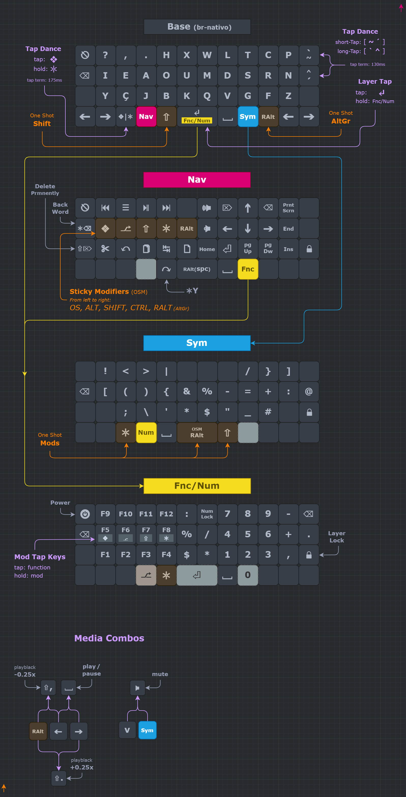

This layout is inspired by:  
[Neo-us by Jan Lunge](https://configure.zsa.io/ergodox-ez/layouts/rbvpb/latest/0)  
[Seniply by Stevep99](https://stevep99.github.io/seniply/)  
[Sweep-Layout by Kiek](https://github.com/duckyb/zmk-sweep)  
[Miryoku by Manna Harbour](https://github.com/manna-harbour/miryoku/tree/master/docs/reference)  

  
  

*This diagram was created using draw.io*  
*Click [HERE](https://viewer.diagrams.net/?tags=%7B%7D&highlight=0000ff&edit=_blank&layers=1&nav=1&title=CSTC40.drawio#Uhttps%3A%2F%2Fraw.githubusercontent.com%2FDropDeadAlex%2Fsys-customs%2Fmain%2FKeyboards%2Fdiagram%2FCSTC40.drawio) to view a copy that you can edit*