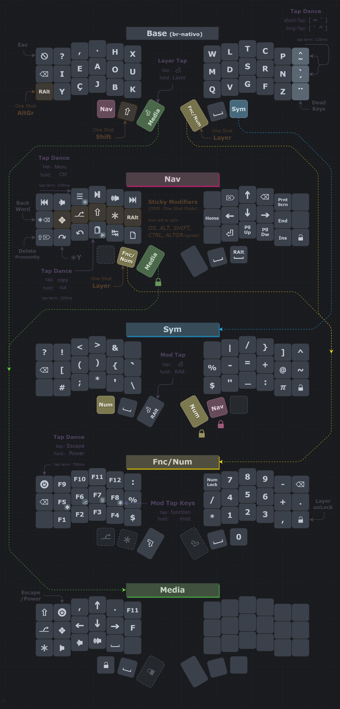

This layout is inspired by:  
[Br-Nativo](https://pt.wikipedia.org/wiki/BR-Nativo) by [Aristides Caldeira](http://web.archive.org/web/20111128095157/http://tecladobrasileiro.laumi.org/index.php?option=com_frontpage&Itemid=1)  
[Neo-us](https://configure.zsa.io/ergodox-ez/layouts/rbvpb/latest/0) by [Jan Lunge](https://www.youtube.com/c/JanLunge)  
[Seniply](https://stevep99.github.io/seniply/) by [Stevep99](https://github.com/stevep99)  
[Sweep-Layout](https://github.com/duckyb/zmk-sweep) by [Kiek](https://github.com/duckyb/)  
[Miryoku by Manna Harbour](https://github.com/manna-harbour/miryoku/tree/master/docs/reference)  

  
  

*This diagram was created using draw.io*  
*Click [HERE](https://viewer.diagrams.net/?tags=%7B%7D&highlight=0000ff&edit=_blank&layers=1&nav=1&title=Corne.drawio#Uhttps%3A%2F%2Fraw.githubusercontent.com%2FDropDeadAlex%2Fsys-customs%2Fmain%2FKeyboards%2Fdiagrams%2FCorne%2FCorne.drawio) to view a copy that you can edit*